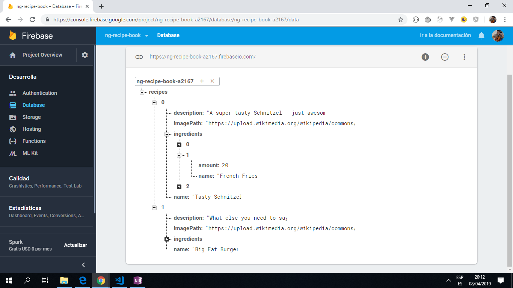

# :zap: Angular Tutorial Recipe Shopping

* An Angular 8 project to display a list of recipes and to store the data in a google Firestore database with full Create, Read, Update and Delete functionality from the UI.

*** Note: to open web links in a new window use: _ctrl+click on link_**

## :page_facing_up: Table of contents

* [General info](#general-info)
* [Screenshots](#screenshots)
* [Technologies](#technologies)
* [Setup](#setup)
* [Features](#features)
* [Status](#status)
* [Inspiration](#inspiration)
* [Contact](#contact)

## :books: General info

The course project is a recipe/shopping list app and it takes input from the following sections of the course:

* Section 6: Components and data-binding: *ngIf, *ngFor
* Section 8: Directives: shared folder created, dropdown directive created.
* Section 10: Services: recipe.services ile created. Using a Service for Cross-Component Communication. Using services for pushing data from A to B.
* Section 12: Routing.
* Section 14: Observables.
* Section 16: Forms.
* Section 19: Http.

## :camera: Screenshots

.
.

## :signal_strength: Technologies

* [Angular v8](https://angular.io/)
* [Angular CLI v8](https://cli.angular.io/).
* [Firebase v6](https://firebase.google.com/)
* [Reactive Extensions for Javascript -RxJS v6](https://angular.io/guide/rx-library) library used for reactive programming using the observable type.

## :floppy_disk: Setup

* Run `ng serve` for a dev server. Navigate to `http://localhost:4200/`. The app will automatically reload if you change any of the source files.
* Run `ng build` to build the project. The build artifacts will be stored in the `dist/` directory. Use the `--prod` flag for a production build.
* Run `ng test` to execute the unit tests via [Karma](https://karma-runner.github.io).
* Run `ng e2e` to execute the end-to-end tests via [Protractor](http://www.protractortest.org/).

## :computer: Code Examples

* _Recipe detail template._

```html
<!-- Display recipe image -->
<div class="row">
  <div class="col-xs-12">
    
  </div>
</div>

<!-- display recipe name as heading -->
<div class="row">
  <div class="col-xs-12">
    <h1>{{ (recipeState | async).recipes[id].name }}</h1>
  </div>
</div>

<!-- dropdown button menu with 3 options listed -->
<div class="row">
  <div class="col-xs-12">
    <div
      class="btn-group"
      appDropdown>
      <button
        type="button"
        class="btn btn-primary dropdown-toggle">
        Manage Recipe <span class="caret"></span>
      </button>
      <ul class="dropdown-menu">
        <li><a (click)="onAddToShoppingList()" style="cursor: pointer;">To Shopping List</a></li>
        <li><a style="cursor: pointer;" (click)="onEditRecipe()">Edit Recipe</a></li>
        <li><a style="cursor: pointer;" (click)="onDeleteRecipe()">Delete Recipe</a></li>
      </ul>
    </div>
  </div>
</div>

<!--  display recipe description and list of ingredients - name and amount -->
<div class="row">
  <div class="col-xs-12">
    {{ (recipeState | async).recipes[id].description }}
  </div>
</div>
<div class="row">
  <div class="col-xs-12">
    <ul class="list-group">
      <li
        class="list-group-item"
        *ngFor="let ingredient of (recipeState | async).recipes[id].ingredients">
        {{ ingredient.name }} - {{ ingredient.amount }}
      </li>
    </ul>
  </div>
</div>
```

## :cool: Features

* Possible to add recipes to a recipe list, with a description, list of ingredients and an image.
* Firebase database store of recipes and recipe details.

## :clipboard: Status & To-Do List

* Status: Registration/Login works with username and password stored in Firebase project user database.
* To-Do: Complete testing. Document code and improve README file.

## :clap: Inspiration

* All code is from [Maximilian Schwarzmüller's Angular 7 course](https://www.udemy.com/the-complete-guide-to-angular-2/learn/v4/overview)

## :envelope: Contact

* Repo created by [ABateman](https://www.andrewbateman.org) - feel free to contact me!
